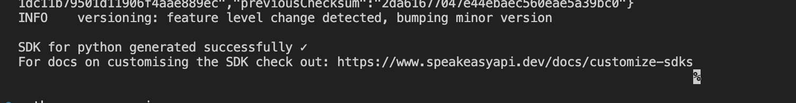
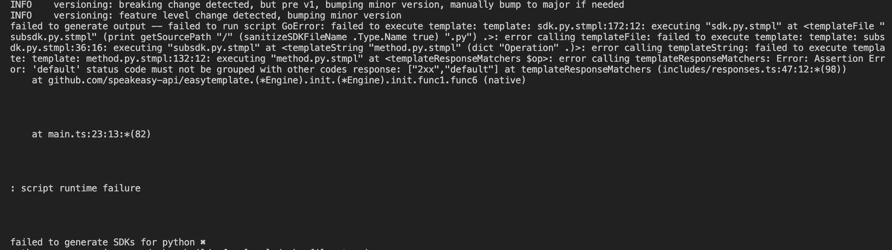

# What you did

Create a `se.dockerfile` file and add the following replacing `YourApiKey` with speakeasy api key

```docker
FROM alpine:3.19
WORKDIR /app
RUN apk add bash go curl unzip sudo nodejs npm
RUN curl -fsSL https://raw.githubusercontent.com/speakeasy-api/speakeasy/main/install.sh | sh;
ENV GOPATH=/root/go
ENV PATH=$PATH:$GOPATH/bin
ENV SPEAKEASY_API_KEY=YourApiKey
```

Build image will install latest cli version

```
docker build -f se.dockerfile -t seimage .
```

- Get the spec from [https://editor-next.swagger.io/](https://editor-next.swagger.io/) under **File → Load Example → OpenAPI 3.1  Petstore** and add it to a  `pestore31.yml` file
- Create a folder called `app` and add the `pestore31.yml` file
- Replace the servers url in `pestore31.yml`

```
servers:
  - url: https://petstore31.swagger.io/api/v31
```

Generate SDK 

```
docker run --platform linux/amd64 --rm -v "./app:/app" seimage speakeasy generate sdk --schema /app/petstore31.yaml --lang python --out /app/se
```

Generation generates for v1

- Modify generated `app/se/.speakeasy/gen.yml`  and change `templateVersion: v1` to `templateVersion: v2`
- Change the additonal dependencies section to (or remove) in `app/se/.speakeasy/gen.yml` ( if this is not done an error `validation error: gen.yaml validation error for python: additionalDependencies.extraDependencies.dev must be a string` will occur)

> Following instructions from
[https://gist.github.com/TristanSpeakEasy/07d971ed2b484e7583804dd120ba2d1b](https://gist.github.com/TristanSpeakEasy/07d971ed2b484e7583804dd120ba2d1b)
```
additionalDependencies:
  dev: {}
  main: {}
```

Regenerate the SDK 

```html
docker run --platform linux/amd64 --rm -v "./app:/app" seimage speakeasy generate sdk --schema /app/petstore31.yaml --lang python --out /app/se
```

# What you expected to happen



# What actually happened.

The following error occurs




# Workaround

Downlaod and modify the install script from [https://raw.githubusercontent.com/speakeasy-api/speakeasy/main/install.sh](https://raw.githubusercontent.com/speakeasy-api/speakeasy/main/install.sh) to install cli version 1.321.0 instead of latest 

Build image with modified install script 

```
FROM alpine:3.19
WORKDIR /app
RUN apk add bash go curl unzip sudo nodejs npm
COPY install.sh /app/install.sh
RUN chmod +x /app/install.sh && /app/install.sh
ENV GOPATH=/root/go
ENV PATH=$PATH:$GOPATH/bin
ENV SPEAKEASY_API_KEY=YourApiKey
```

```
docker build -f se.dockerfile -t seimage .
```

Generate SDK with  cli v1.321.0

```bash
docker run --platform linux/amd64 --rm -v "./app:/app" seimage speakeasy generate sdk --schema /app/petstore31.yaml --lang python --out /app/se
```

Modify generated `app/se/.speakeasy/gen.yml`  and change `templateVersion: v1` to `templateVersion: v2`

Regeneration seems to work even without modifying the `additionalDependencies` in `app/se/.speakeasy/gen.yml`

```docker
  additionalDependencies:
    dependencies: {}
    extraDependencies:
      dev: {}
```

Regenerate SDK

```html
docker run --platform linux/amd64 --rm -v "./app:/app" seimage speakeasy generate sdk --schema /app/petstore31.yaml --lang python --out /app/se
```

